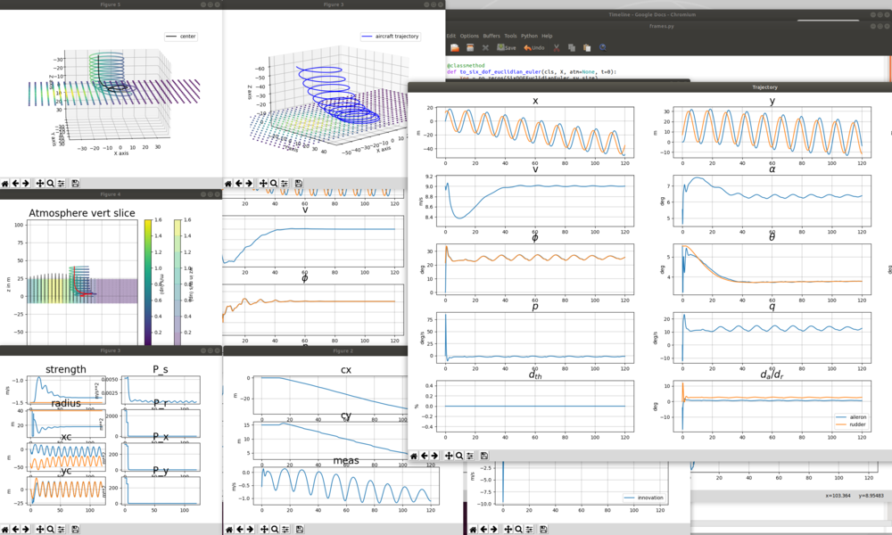

# PAT (Python Aerospace Toolbox)

Some stuff related to aerospace simulation, documentation over [there](https://poine.github.io/pat).

<p align="center">
  
</p>

## Quickstart

### Installing

 * clone sources:
 ```console
 cd
 git clone https://github.com/poine/pat.git
 ```

 * Make sure Python is able to find the cloned directory. For example, on Linux, you could use:

 ```console
 poine@nina:~$ export PYTHONPATH=$PYTHONPATH:/home/poine/pat/src
 ```

 * You can test that it worked with

 ```console
 poine@nina:~$ python -c "import pat3; print(pat3.__version__)"
 ```

Done... (unless you need the [ROS part](https://poine.github.io/pat/ros_intro.html), for example 3D display in rviz)


###  Running Examples:

   * fixed wing
 
```console
poine@nina:~/pat$ ./src/pat3/test/fixed_wing/test_02_att_ctl.py
```

```console
poine@nina:~/pat$ ./src/pat3/test/fixed_wing/test_03_guidance.py
```


   * multirotor
 
```console
poine@nina:~/pat$ ./src/pat3/test/rotorcraft/sim_guidance.py --traj smooth_oval2
```


